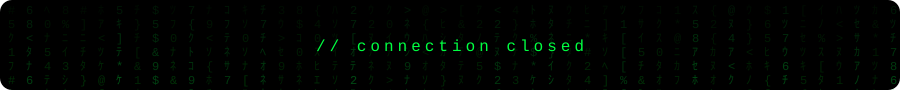

  

 access granted" />

  

  

  

<picture>
  <source media="(prefers-color-scheme: dark)" srcset="https://raw.githubusercontent.com/tinhbv101/tinhbv101/output/snake-matrix-dark.svg" />
  <source media="(prefers-color-scheme: light)" srcset="https://raw.githubusercontent.com/tinhbv101/tinhbv101/output/snake-matrix-light.svg" />
  
</picture>

  

